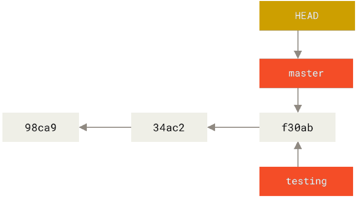
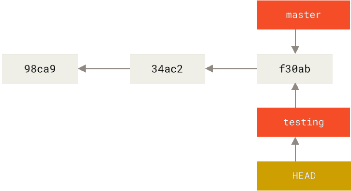
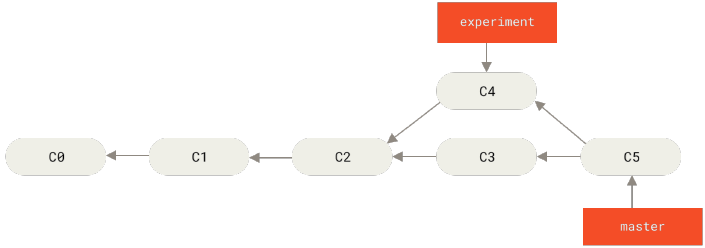
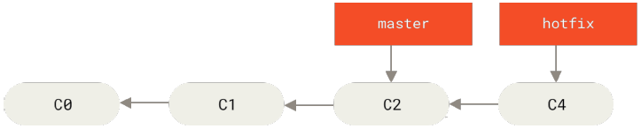
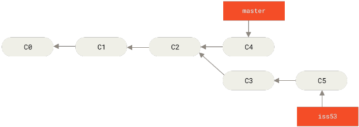
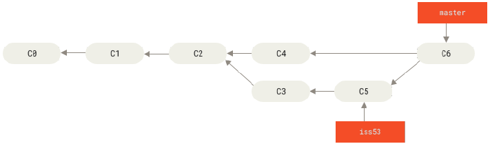
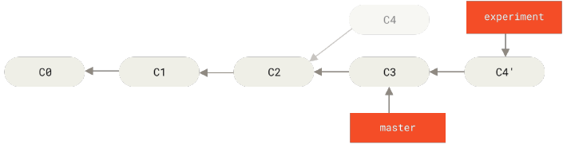
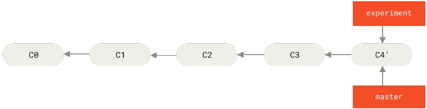
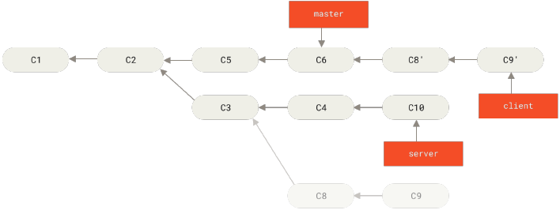

# git for windown
- [git for windown](#git-for-windown)
- [概念](#概念)
- [基础流程](#基础流程)
  - [1.配置并初始化一个仓库(repository)](#1配置并初始化一个仓库repository)
  - [2.开始或停止跟踪(track)文件、暂存(stage)或提交(commit)更改](#2开始或停止跟踪track文件暂存stage或提交commit更改)
  - [3.配置git来忽略指定的文件](#3配置git来忽略指定的文件)
  - [4.历史](#4历史)
  - [5.远程仓库](#5远程仓库)
  - [6.别名](#6别名)
- [分支](#分支)
  - [查看](#查看)
  - [新分支](#新分支)
  - [删除](#删除)
  - [合并](#合并)
  - [远程](#远程)
  - [变基](#变基)
- [快速返回](#快速返回)
- [git命令](#git命令)
  - [版本更新](#版本更新)
  - [帮助](#帮助)
  - [配置](#配置)
  - [初始化](#初始化)
  - [克隆](#克隆)
  - [文件状态](#文件状态)
  - [添加](#添加)
  - [提交](#提交)
  - [差异](#差异)
  - [移除](#移除)
  - [移动/重命名](#移动重命名)
  - [重置(reset)](#重置reset)
  - [查看提交历史](#查看提交历史)
  - [远程操作](#远程操作)
  - [远程拉取](#远程拉取)
  - [远程推送](#远程推送)
  - [标签](#标签)
  - [(git show)](#git-show)
  - [分支](#分支-1)
  - [检出](#检出)
  - [合并](#合并-1)
  - [变基](#变基-1)
- [快速跳转](#快速跳转)
- [待处理](#待处理)

# 概念
**git有三种状态**
- 已修改(modified)，表示修改了文件，但还没保存到数据库中
- 已暂存(staged)，表示对一个已修改的文件做了标记，使之包含在下次提交的快照[^1]中
- 已提交(committed)，表示数据已经安全保存在本地数据库中
  
[^1]:快照（待补充）

**git基本工作流程**\

1. 在工作区修改文件(modified)
2. 将你想要下次提交的更改选择性地暂存，这样只会将更改的部分添加到暂存区(staged)
3. 提交更新，找到暂存区的文件，将快照永久性存储到Git目录(committed)

# 基础流程
## 1.配置并初始化一个仓库(repository)
- 在已存在目录中初始化仓库(空，无跟踪文件)\
   `git init`
- 克隆现有的仓库\
   `git clone`

## 2.开始或停止跟踪(track)文件、暂存(stage)或提交(commit)更改
工作目录下每个文件根据是否纳入版本控制(git已经知道)分为**已跟踪**or**未跟踪**

- 查看当前文件状态\
  `git status`

- 跟踪文件暂存区(将内容添加到下一次提交中)\
  `git add`

- 查看修改
  - 比较工作目录中文件(已修改/未修改)和暂存区文件的差异\
    `git diff`
  - 比较暂存区文件和git仓库文件的差异\
    `git diff --staged/--cached`

- 提交更新\
  `git commit`

- 移除文件(停止追踪)
  - 有保护机制，加-f包括源文件删除
    `git rm -f`
  - 加--ached，仅从git仓库删除
    `git rm --ached`

- 移动/重命名文件\
  `git mv`

- 撤销
  - 撤销提交，新的提交替换旧的提交\
    `git commit --amend`
  - 撤销添加暂存\
    `git reset HEAD <file>`
  - 撤销修改\
    `git checkout - <file>`

## 3.配置git来忽略指定的文件
- 忽略文件(使用失败，待厘清)
  - 创建一个.gitignore文件
    ```
    # 忽略所有的 .a 文件
    *.a
    # 但跟踪所有的 lib.a，即便你在前面忽略了 .a 文件
    !lib.a
    # 只忽略当前目录下的 TODO 文件，而不忽略 subdir/TODO
    /TODO
    # 忽略任何目录下名为 build 的文件夹
    build/
    # 忽略 doc/notes.txt，但不忽略 doc/server/arch.txt
    doc/*.txt
    # 忽略 doc/ 目录及其所有子目录下的 .pdf 文件
    doc/**/*.pdf
    ```
  - 文件.gitignore的格式规范
    - 所有空行或者以`#`开头的行都会被git忽略
    - 可以使用标准的glob[^2]模式匹配，它会递归地应用在整个工作区中
    - 匹配模式可以`/`开头防止递归
    - 匹配模式可以`/`结尾指定目录
    - 要忽略指定模式以外的文件或目录，可以在模式前加上`!`取反

    [^2]:指 shell 所使用的简化了的正则表达式。 星号（*）匹配零个或多个任意字符；[abc] 匹配任何一个列在方括号中的字符 （这个例子要么匹配一个 a，要么匹配一个 b，要么匹配一个 c）； 问号（?）只匹配一个任意字符；如果在方括号中使用短划线分隔两个字符， 表示所有在这两个字符范围内的都可以匹配（比如 [0-9] 表示匹配所有 0 到 9 的数字）。 使用两个星号（\*\*）表示匹配任意中间目录，比如 a/\*\*/z 可以匹配 a/z 、 a/b/z 或 a/b/c/z 等。

## 4.历史
- 查看提交历史，不传入参数按时间先后顺序列出所有的提交，列出每个提交的 SHA-1 校验和、作者的名字和电子邮件地址、提交时间以及提交说明。\
  `git log`
  ```
  commit 18dac74e6875ed1da275f53c1762cd8aca675fdc (HEAD -> master, origin/master, origin/HEAD)
  Author: HongJiong <135309490+HongJiong@users.noreply.github.com>
  Date:   Fri Mar 22 18:37:48 2024 +0800

    Add files via upload

  commit 96c7015d90f07720a0de5a51e5b7438ccec62e5f
  Author: HongJiong <hongjiong_zhu@163.com>
  Date:   Fri Mar 22 18:19:14 2024 +0800

    add img for usage-of-github
  ```

- 标签
  - 列出已有\
    `git tag`\
    匹配"v1.8.5"开头的标签\
    `git tag -l "v1.8.5*"`

  - 创建
    - 轻量标签\
      `git tag <tagName>`
    - 附注标签，是存储在 Git 数据库中的一个完整对象， 可以被校验，包含打标签者的名字、电子邮件地址、日期时间，还有一个标签信息，并且可以使用 GNU Privacy Guard （GPG）签名并验证\
      `git tag -a <tagName> -m "tagLog"`
    - 后期标签，给已提交的版本打标\
      `git tag -a <tagName> <hash>`\
      `git tag <tagName> <hash>`

  - 输出信息\
    `git show <tagName>`

  - 远程共享
    - `git push`默认不会传标签到远程仓库，需要：\
      `git push <libName> <tagName>`
    - 推送所有标签\
      `git push <libName> --tags`

  - 删除\
    `git tag -d <tagName>`
    - 推送删除的标签\
      `git push <libName> :refs/tags/<tagName>`\
      `git push <libName> --delete <tagName>`

## 5.远程仓库
- 查看\
  `git remote`\
  `git remote show <libName>`

- 添加\
  `git remote add <libName> <url>`

- 拉取\
  `git fetch <libName>`\
  `git pull`

- 推送\
  `git push <libName> <branchName>`

- 重命名\
  `git remote rename oldLibName newLibName`

- 移除\
  `git remote remove libName`\
  `git remote rm libName`

## 6.别名
- 创建git cmd别名\
  `git config [level] alias.<newName> <cmdName>`

- 查看定义的别名\
  `git config --global -l | grep alias`

- 取消别名\
  `git config --global --unset alias.<newName>`

# 分支
Git的分支，其实本质上仅仅是**指向提交对象的可变指针**，通常称`HEAD`。Git的默认分支名字是 master，与其它分支没有区别。

## 查看
- 获取所有分支列表，`*`代`表HEAD->`\
  `git branch`
  ```
  $ git branch
    iss53
  * master
    testing
  ```
- 获取每个分支最后一次提交\
  `git branch -v`
- 过滤已/未合并分支\
  `git branch --merged/--no-merged`
- 获取每个分支详细信息\
  `git branch -vv`
  ```
  $ git branch -vv
    iss53 7e424c3 [origin/iss53: ahead 2] forgot the brackets
    master 1ae2a45 [origin/master] deploying index fix
  * serverfix f8674d9 [teamone/server-fix-good: ahead 3, behind 1] this should do it
    testing 5ea463a trying something new
  ```
  - `ahead 2`代表本地还有两个提交还没有推送到服务器上
  - `ahead 3, behind 1`代表本地还有三个提交还没有推送到服务器上，服务器有一次提交没有合入到本地
  - 服务器信息基于本地，所以要先`git fetch --all`

## 新分支
- 创建，从`HEAD`看出没有切换到新分支\
  `git branch <branchName>`
  
- 切换，从`HEAD`看出切换到新分支\
  `git checkout <branchName>`
- 创建并切换\
  `git checkout -b <branchName>`
  

## 删除
- 只能删除未合并分支\
  `git branch -d <branchName>`

## 合并
把两个分支的最新快照（C3 和 C4）以及二者最近的共同祖先（C2）进行三方合并，合并的结果是生成一个新的快照（并提交）。\


- 将所在分支与目标分支合并，并自动提交\
  `git merge <targetBranchName>`
  - fast-forward:合并(master与hotfix)没有要解决的冲突
    
  - 不同父继承合并
    |||
    |:---:|---|
    |↓||
    |||

- 冲突合并：需合并的两个不同的分支中，对同一个文件的同一个部分进行了不同的修改，不会自动提交
  1.  ```
      $ git merge iss53
      Auto-merging index.html
      CONFLICT (content): Merge conflict in index.html
      Automatic merge failed; fix conflicts and then commit the result.
      ```
  2.  用git status查看冲突(unmerged)信息
      ```
      $ git status
      On branch master
      You have unmerged paths.
        (fix conflicts and run "git commit")

      Unmerged paths:
        (use "git add <file>..." to mark resolution)

          both modified:      index.html
      no changes added to commit (use "git add" and/or "git commit -a")
      ```
  3.  打开冲突文件，其中包含以而写特殊区段
      > `=======`的上半部分为当前分支(HEAD -> master)的index.html文件，下半部分为目标分支(iss53)的index.html文件
      ```
      <<<<<<< HEAD:index.html
      <div id="footer">contact : email.support@github.com</div>
      =======
      <div id="footer">
      please contact us at support@github.com
      </div>
      >>>>>>> iss53:index.html
      ```
  4.  手动更改冲突文件，并对其`git add`暂存，就能解决冲突，再`git commit`

## 远程
- 推送\
  `git push <libName> <branchName>`

- 抓取\
  `git fetch -all`

  - 抓取新的远程跟踪分支`newBranch`时，本地不会有一个新的分支`newBranch`，只有一个不可以修改的`origin/newBranch`指针，需要：
    - 将newBranch合并到当前分支，在当前分支上工作：\
      `git merge origin/newBranch`
    - 在上游(远程)分支上检出跟踪(本地)分支，起点位于`origin/newBranch`：\
      `git checkout -b newBranch origin/newBranch`\
      或 `git checkout --track origin/newBranch`\
      或 如果上游分支在本地不存在，可以直接`git checkout newBranch`
    
  - 如果在跟踪分支上`git pull`，能正确抓取上游分支

  - 通过`@upstream`或`@u`代替当前分支跟踪的上游分支\
    `git merge @u`相当与`git merge origin/master`

- 删除\
  `git push origin --delete <branchName>`

## 变基
将提交到某一分支上的所有修改都移至另一分支上，操作的实质是丢弃一些现有的提交，然后相应地新建一些内容一样但实际上不同的提交，**会改变提交历史**
- 提取在 C4 中引入的补丁和修改，然后在 C3 的基础上应用一次
  1. 检出experiment分支，然后变基到master分支上
     ~~~
     $ git checkout experiment
     $ git rebase master
     First, rewinding head to replay your work on top of it...
     Applying: added staged command
     ~~~
     
  2. 回到master进行一次合并
     ~~~
     $ git checkout master
     $ git merge experiment
     ~~~
     

- 将`client`中的修改合并到`master`，但暂时并不想合并`server`中的修改，即 C8 和 C9
  ~~~
  $ git checkout client
  $ git rebase --onto master server client
  ~~~
  

[快速跳转](#快速跳转)
# 快速返回


# git命令
## 版本更新
2.17.1之前的，使用\
`git update`\
2.17.1之后的，使用\
`git update-git-for-windows`\
其它，[官网下载](https://git-scm.com/download/win)

## 帮助
`git help`\
`git help <verb>` or `git <verb> -h`\
- `verb` e.g. config, clone, add...

## 配置
- 查看所有配置\
  `git config -l`\
  及其所在的文件:\
  `git config --list --show-origin`

- 查看指定配置\
  `git config <key>`
  - `key` e.g. user.name...

- 设置用户信息
  使用了`--global`选项一次，该命令对全局生效，否则仅对工作目录生效
  ```
  git config --global user.name 'hongjiong'
  git config --global user.email hongjiong_zhu@163.com
  ```

- 设置cmd别名
  - 加`[level] alias.<newName> <cmdName>`创建cmd别名
  - 加`[level] -l | grep alias`查看定义别名
  - 加`[level] --unset alias.<newName>`取消别名
  - e.g.`git config --global alias.s 'status -s'`

- 设置凭证助手，无需每次远程操作输入账号密码\
  `git config --global credential.helper cache`

## 初始化
- 在当前目录下创建一个.git\
  `git init`

## 克隆
- 克隆远程仓库每一个文件，每一个版本\
  `git clone <url> <myLibName>` 
  - `<url>`指远程仓库路径
  - `<myLibName>`指克隆库本地命名，不写默认远程仓库名
  ```
  $ git clone git@github.com:HongJiong/UsageOfGit.git origin
  ```

## 文件状态
- 查看目录下文件状态\
  `git status`
- 信息繁琐用加`-s`
  ```
  $ git status -s
  AM usage-of-git.md
  ?? DevSidecar-1.7.3.exe
  ?? Git-2.43.0-64-bit.exe
  ?? img/
  ?? progit.pdf
  ```
  输出信息有两栏，左栏为暂存区状态，右栏为工作区状态
  - `??`为未跟踪文件
  - `A`为新添加到暂存区文件
  - `M`为修改过文件
  - `111.md`为暂存后又做了修改文件

## 添加
- 添加文件到暂存区(添加到下一次提交中)
  ```
  $ git add *.c
  $ git add LICENSE
  ```

## 提交
- 提交暂存区文件到.git仓库\
  `git commit`
  - 加`-m "this is commit log"`将文件与Log同时提交
  - 加`-a`将在暂存区文件清单的文件提交，跳过添加动作
  - 加`-v`将此次提交文件diff呈现在编辑器中
  - 加`--amend`将此次提交代替上一次提交，撤销提交

## 差异
- 请注意，`git diff`本身只显示未暂存的改动
- 加`--staged`或`--cached`查看已经暂存起来的变化
- 配置difftool
  `git difftool --tool-help`

## 移除
要从git中移除某个文件，就必须要从暂存区文件清单中移除，然后提交
- `git rm`会连带移除源文件
- 移除暂存区的文件时，会有保护机制，需要`git rm -f`，也会连带移除源文件
- `git rm -cached`仅移除暂存区
- 多文件移除`git rm <glob>`[^2]

## 移动/重命名
- `git mv <pathSrc> <pathDes>`
  相当于
  ```
  $ mv <pathSrc> <pathDes>
  $ git rm <pathSrc>
  $ git add <pathDes>
  ```

## 重置(reset)
- 
  `git reset`
  - 加`HEAD <file>`，重定位`HEAD`指针，撤销添加暂存的文件

## 查看提交历史
- `git log`
- 常用选项|说明
  ---|---
  -p | 按补丁格式显示每个提交引入的差异
  --stat | 显示每次提交的文件修改统计信息
  --shortstat | 只显示 --stat 中最后的行数修改添加移除统计
  --name-only | 仅在提交信息后显示已修改的文件清单
  --name-status | 显示新增、修改、删除的文件清单
  --abbrev-commit | 仅显示 SHA-1 校验和所有 40 个字符中的前几个字符
  --relative-date | 使用较短的相对时间而不是完整格式显示日期（比如“2 weeks ago”）
  --graph 在日志旁以 | ASCII 图形显示分支与合并历史
  --pretty | 使用其他格式显示历史提交信息。可用的选项包括 oneline、short、full、fuller 和 format（用来定义自己的格式）
  --oneline | --pretty=oneline --abbrev-commit 合用的简写
  限制输出选项 |
  -<n> | 仅显示最近的 n 条提交。
  --since, --after | 仅显示指定时间之后的提交
  --until, --before | 仅显示指定时间之前的提交
  --author | 仅显示作者匹配指定字符串的提交
  --committer | 仅显示提交者匹配指定字符串的提交
  --grep | 仅显示提交说明中包含指定字符串的提交
  -S | 仅显示添加或删除内容匹配指定字符串的提交

  e.g.
  ~~~
  $ git log --pretty="%h - %s" --author='Junio C Hamano' --since="2008-10-01" --before="2008-11-01" --no-merges -- t/
  5610e3b - Fix testcase failure when extended attributes are in use
  acd3b9e - Enhance hold_lock_file_for_{update,append}() API
  f563754 - demonstrate breakage of detached checkout with symbolic link HEAD
  d1a43f2 - reset --hard/read-tree --reset -u: remove unmerged new paths
  51a94af - Fix "checkout --track -b newbranch" on detached HEAD
  b0ad11e - pull: allow "git pull origin $something:$current_branch" into an unborn branch
  ~~~

  - 查看分支历史
    ~~~
    git log --oneline --decorate --graph --all
    * c2b9e (HEAD, master) made other changes
    | * 87ab2 (testing) made a change
    |/
    * f30ab add feature #32 - ability to add new formats to the
    * 34ac2 fixed bug #1328 - stack overflow under certain conditions
    * 98ca9 initial commit of my project
    ~~~

## 远程操作
`git remote`查看LibName
- 加`show <libName>`或`-v`查看详细信息
- 加`add <libName> <url>`添加仓库
- 加`rename oldLibName newLibName`仓库重命名
- 加`remove libName`或`rm`移除仓库看

## 远程拉取
- 从服务器上抓取本地没有的数据，可以随时合并或查看\
  `git fetch <libName>`
  - 拉取服务所有信息\
    `git fetch --all`
- 从服务器上抓取本地没有的数据，并合并\
  `git pull`，相当于`git fetch` + `git merge`

## 远程推送
- 将本地仓库信息推送到远程仓库\
  `git push <libName>`
  - 加`<branchName>`推送分支

  - 加`<tagName>`将远程共享标签
  - 加`--tags`将远程共享所有标签
  - 加`:refs/tags/<tagName>`或`--delete <tagName>`远程删除标签

  - 加`--delete <branchName>`删除对应分支
  
## 标签
`git tag`列出已有
- 加`-l "v*"`列出匹配"v"开头的标签
- 加`<tagName>`创建轻量标签
- 加`-a <tagName> -m "tagLog"`创建附注标签
  - 创建标签再加`<hashHistory>`给历史提交打标
- 加`-d <tagName>`删除标签

## (git show)
- 加`<tagName>`打印标签信息

## 分支
获取所有分支列表\
`git branch`
- 加`--`merged/--no-merged过滤已/未合并分支
- 加`-v`获取每个分支最后一次提交
- 加`-vv`获取每个分支详细信息
- 加`-d <branchName>`删除未合并分支

## 检出
- 移动`HEAD`指针，并将工作目录/文件恢复到`HEAD`指向的分支版本(相应分支最后一次提交)，原内容不会保存\
  `git checkout`
  - 加`HEAD - <file>`撤销修改的文件
  - 加`<branchName>`切换分支
  - 加`-b <branchName>`创建并切换分支

## 合并
将所在分支与目标分支合并，并自动提交
`git merge <targetBaranchName>`

## 变基
提取当前分支的修改合入目标分支\
`git rebase <targetBranch>`
- 提取当前分支中不包含上游分支的修改合入目标分支\
  `git rebase --onto <targetBranch> <upstreamBranch> <currentBranch>`

# 快速跳转
[快速返回](#快速返回)

# 待处理
- [ ] .git里文件信息参考git内部原理
- [ ] .gitignore忽略文件使用失败
- [ ] 配置difftool
